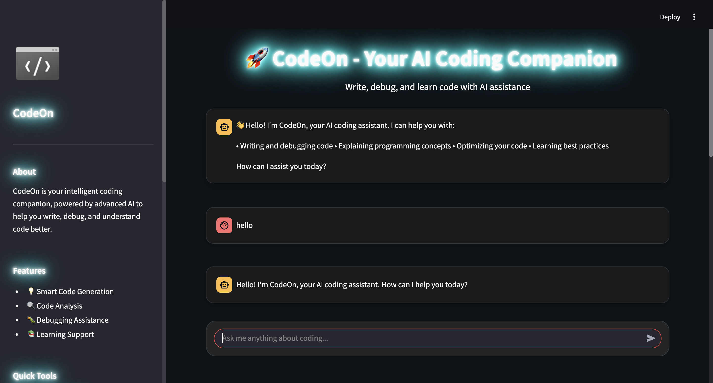
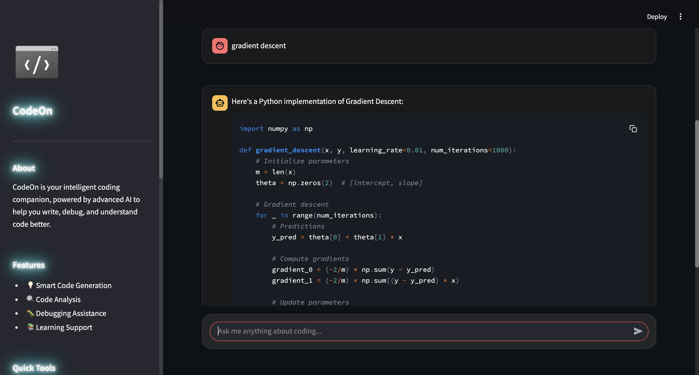
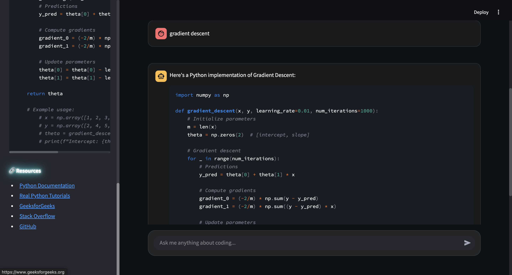
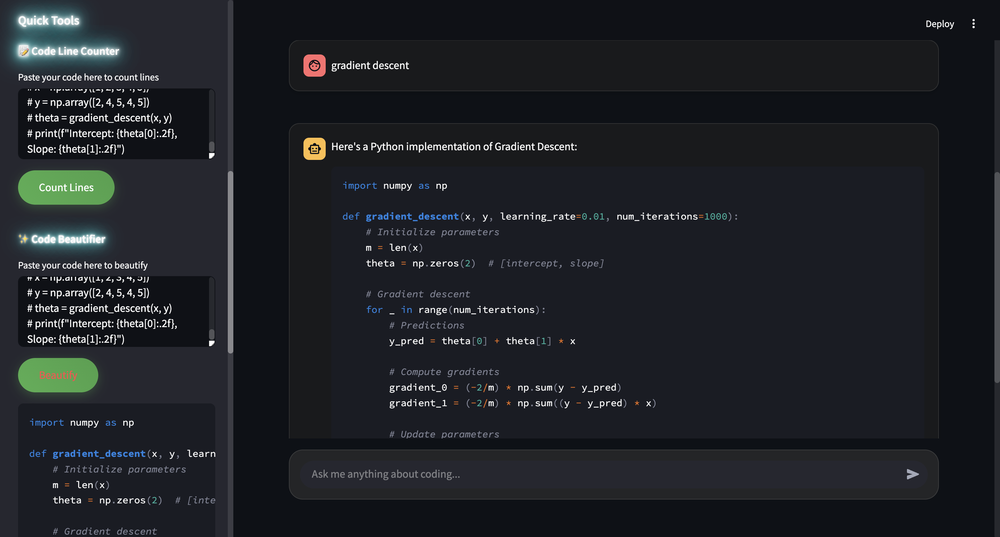

# 🚀 CodeOn - AI-Powered Code Assistant

<div align="center">

[](https://streamlit.io/)
[](https://www.python.org/)
[](https://ollama.ai/)
[](LICENSE)

</div>

## ✨ Features

- 🤖 **Intelligent Code Analysis**: Powered by CodeLlama for accurate code understanding and generation
- 🎨 **Modern UI**: Sleek Streamlit interface with neon effects and responsive design
- 🔧 **Code Tools**: 
  - Code complexity analysis
  - Line counting
  - Code beautification
  - Real-time code execution
- 📚 **Learning Resources**: Comprehensive programming guides and documentation
- 🔒 **Local Processing**: Run everything locally with Ollama integration

## 🎥 Demo Video

[](https://drive.google.com/file/d/1c_W9yzS8jnnJb4IikS1E0Jpv0wgZObU2/view)

> Click the button above to watch the third demo of the project hosted on Google Drive.

## 📸 Screenshots

<div align="center">
  
  <p><em>Interactive Chat Interface</em></p>
</div>

<div align="center">
  
  <p><em>Code Analysis Tools</em></p>
</div>

<div align="center">
  
  <p><em>Learning Resources Section</em></p>
</div>

<div align="center">
  
  <p><em>Advanced Code Tools</em></p>
</div>

## 🛠️ Tech Stack

- **Frontend**: Streamlit
- **AI Model**: CodeLlama (via Ollama)
- **Framework**: Langchain
- **Language**: Python 3.11+

## 🚀 Quick Start

### Prerequisites

- [Python 3.11+](https://www.python.org/downloads/)
- [Ollama](https://ollama.ai/download)
- [Git](https://git-scm.com/downloads)

### Installation

1. **Clone the repository**
```bash
git clone https://github.com/yourusername/codeon.git
cd codeon
```

2. **Create and activate virtual environment**
```bash
python -m venv .venv
source .venv/bin/activate  # On Windows: .venv\Scripts\activate
```

3. **Install dependencies**
```bash
pip install -r requirements.txt
```

4. **Download and setup CodeLlama model**
```bash
cd models
wget https://huggingface.co/TheBloke/CodeLlama-7B-Instruct-GGUF/resolve/main/codellama-7b-instruct.Q4_K_M.gguf
cd ..
```

5. **Create custom model**
```bash
ollama create codybot -f Modelfile
```

6. **Run the application**
```bash
streamlit run app.py
```

## 🎯 Features in Detail

### Code Analysis
- Real-time code complexity assessment
- Function and class detection
- Code structure visualization

### Code Tools
- **Line Counter**: Analyze code metrics
- **Beautifier**: Format and clean code
- **Executor**: Run code snippets safely

### Learning Resources
- Programming guides
- Best practices
- Code examples
- Documentation links

## 🤝 Contributing

Contributions are welcome! Please feel free to submit a Pull Request.

1. Fork the repository
2. Create your feature branch (`git checkout -b feature/AmazingFeature`)
3. Commit your changes (`git commit -m 'Add some AmazingFeature'`)
4. Push to the branch (`git push origin feature/AmazingFeature`)
5. Open a Pull Request

## 🙏 Acknowledgments

- [CodeLlama](https://github.com/facebookresearch/codellama) for the base model
- [Ollama](https://github.com/ollama/ollama) for local model serving
- [Streamlit](https://streamlit.io/) for the web interface
- [Langchain](https://github.com/langchain-ai/langchain) for the AI framework

## 📚 References

- [CodeLlama Documentation](https://github.com/facebookresearch/codellama)
- [Ollama Modelfile Guide](https://github.com/ollama/ollama/blob/main/docs/modelfile.md)
- [Streamlit Documentation](https://docs.streamlit.io/)
